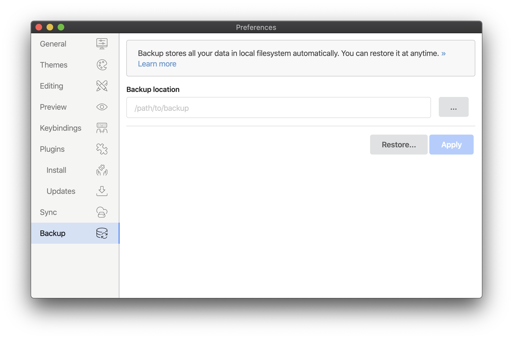

We humans are not perfect. No matter how much you are careful to manage your password, you possibly lose it for various reasons.
No matter how much we are carefully operating our servers, we possibly lose your data.
So, please do take a backup!

You can back up all your data to your local filesystem and restore it at anytime.
Inkdrop stores them as JSON files **continuously** while you use it. It works like local replication.
You can configure where to store from the preferences:

Specify the file path for the backup and then click the _'Apply'_ button.
You can also input the file path easily by clicking _'...'_ button which opens an dialog to select the directory.

Now your backup folder contains three directories as following:

- **state**: The state information of backup for each client
- **data**: Documents of your notes, notebooks, tags and attachments
- **\_deleted**: Deleted documents will be moved here. You can move files from it to the `data` folder if you would like to restore them.

To restore your backup, click the _'Restore...'_ button which opens a dialog to select your backup location and then the data restore will start.

## Exporting Data as Markdown

Since the backup data is in JSON format, it is not useful in some cases.
You can export all note data in Markdown format from the application menu _File_ -> _Export_ -> _All Notes.._.
