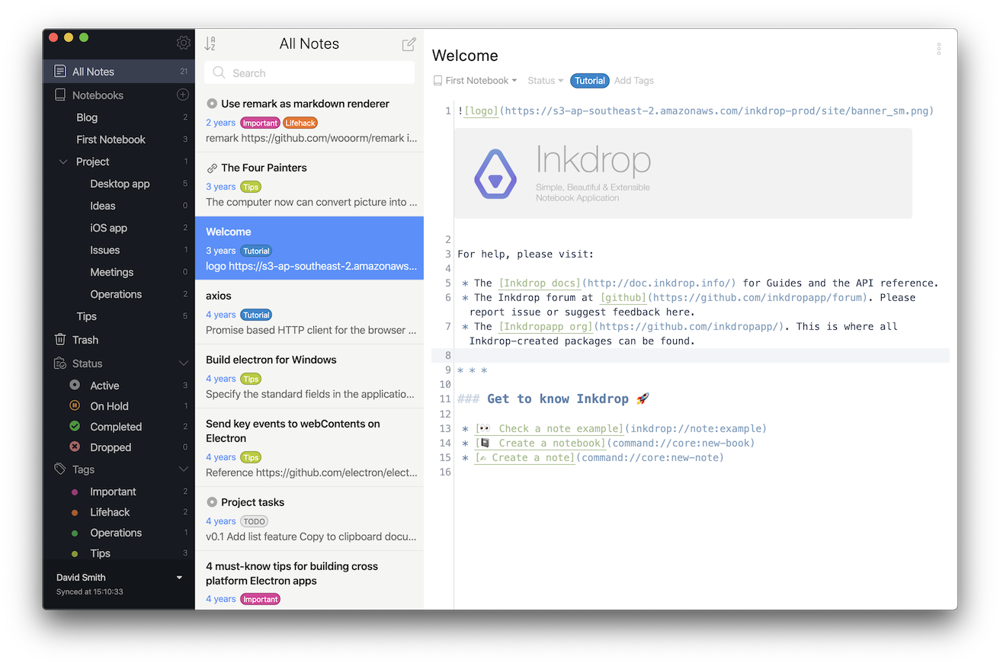
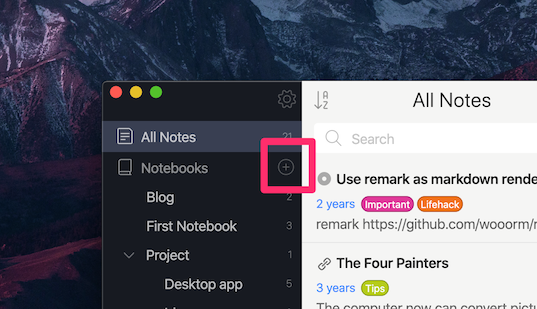
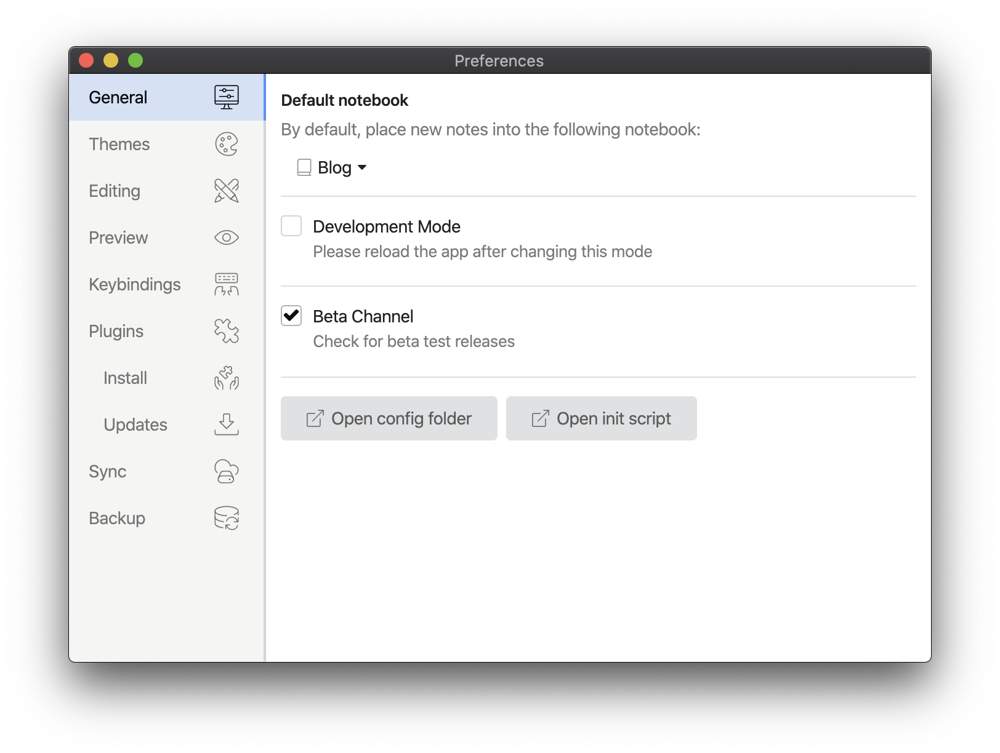

## Get acquainted with Inkdrop interface

Inkdrop interface is broken up into 3 main sections.

- **Sidebar** is the leftmost section. It lists notebooks, statuses, and tags. 
  - Notebooks are like folders that store your notes. You can nest notebooks in one another as deeply as needed.
  - Statuses help you treat notes as tasks and, for example, display only active or completed ones. 
  - Tags are like labels that let you link notes with one another. For example, if they relate to a common topic.
  You can toggle the Sidebar by using <kbd>Command+/</kbd> on macOS or <kbd>Ctrl+/</kbd> on Windows and Linux.
- **Note list** is located amid. All your notes live here ordered by modification date by default. You can search for notes via the search box at the very top of the section.
- **Editor** is the rightmost section. This is where your magic happens 🪄 — your workspace. 

**More useful shortcuts:**

- <kbd>Command+E</kbd> or <kbd>Ctrl+E</kbd> — to switch between the editor and preview modes.
- <kbd>Command+P</kbd> or <kbd>Ctrl+P</kbd> — to display the editor and preview side-by-side.
- <kbd>Command+Shift+D</kbd> or <kbd>Ctrl+Shift+D</kbd> — to enter/leave the 'Distraction Free Mode' 🧘 Is when the sidebar and note list are hidden, and you can focus on the writing process.

## Create new note and notebook

To create a new note, you can either click the  icon on the right top of the note list or use the <kbd>Command+N</kbd> / <kbd>Ctrl+N</kbd> shortcut. The newly created note will appear in the **Note list** section.

To create a new notebook, click the  icon next to the **Notebooks** title:

To create a sub notebook: 

1. Right-click the notebook, which will be the parent, and select **New Sub Notebook..**.
2. Provide a title for the nested notebook.
3. Click **Create**.  
The newly created notebook will appear inside the parent one.  

## Settings and preferences

Inkdrop has the **Preferences** view where you can fine-tune look and feel of the app. To open the **Preferences** view, take the following steps:

### MacOS

Go to **Inkdrop** > **Preferences** in the menu bar. Alternatively, you can use the <kbd>Command+,</kbd> shortcut. 

### Windows and Linux

Go to **File** > **Settings** in the menu bar. Alternatively, you can use the <kbd>Ctrl+,</kbd> shortcut.

And you will see the window like this:

## User data directory

Inkdrop stores your data and config locally at the following path:

- on macOS: `~/Library/Application Support/inkdrop/`
- on Windows: `%APPDATA%\inkdrop\`
- on Linux:
  - deb/rpm: `~/.config/inkdrop/`
  - Snap: `~/snap/inkdrop/current/.config/inkdrop/`

To open it in a file manager, go to **Preferences** > **General** and select **Open Config Folder**.

The config folder has the following files and folders:

- `config.cson` — app config file in the [CSON format](https://github.com/bevry/cson#what-is-cson)
- `keymap.cson` — keybindings config file in the [CSON format](https://github.com/bevry/cson#what-is-cson)
- `packages/` — installed plugins
- `db/` — local database
