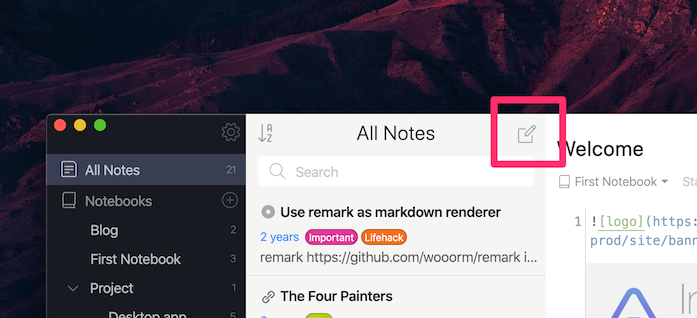

## Inkdrop has three parts

- **Sidebar** (on the left): it lists notebooks, statuses and tags here. Notebooks are like folders you can create recursively. Statuses are additional information to treat notes as tasks. Tags are like labels which can link notes with related topic.
- **Note list** (in the middle): all your notes live here, ordered by modification date by default. You can search notes with keywords from a search bar on the top of it.
- **Editor** (on the right): this is where your magic happens; you're looking at it. 😄

## Creating new note and notebook

To create new note, you can either push a button on the right top of the note list or input keybind `Cmd+N` / `Ctrl+N`.

To create new notebook, click 'Add' button on the right of 'Notebooks' section:

To create a sub notebook, right click on the notebook item which would be parent and choose "New Sub Notebook.." menu.

## Settings and preferences

Inkdrop has a number of settings and preferences you can modify in the Preferences View.

To open the Settings View, you can:

- on macOS:
  - Use the _Inkdrop > Preferences_ menu item in the menu bar
  - Use the `Cmd+,` keybinding
- on Windows & Linux:
  - Use the _File > Settings_ menu item in the menu bar
  - Use the `Ctrl+,` keybinding

And you should see the window like this:

## User data directory

Inkdrop stores your data and config in local at the following path:

- on macOS: `~/Library/Application Support/inkdrop/`
- on Windows: `%APPDATA%\inkdrop\`
- on Linux:
  - deb/rpm: `~/.config/inkdrop/`
  - Snap: `~/snap/inkdrop/current/.config/inkdrop/`

You can open it up in a file manager from _Preferences -> General -> Open Config Folder_.

This directory has the following files and folders:

- `config.cson`: The app config file in [CSON format](https://github.com/bevry/cson#what-is-cson)
- `keymap.cson`: The keybindings config file in [CSON format](https://github.com/bevry/cson#what-is-cson)
- `packages/`: Installed plugins
- `db/`: The local database
