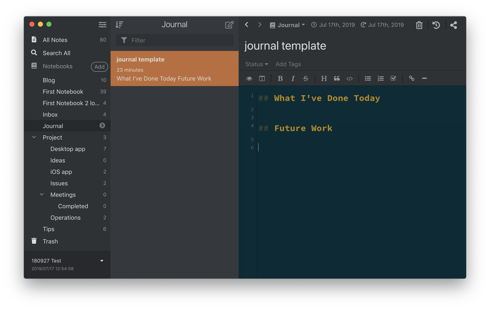
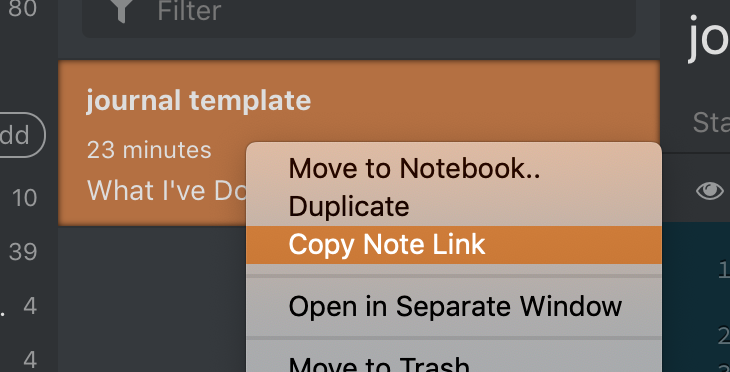
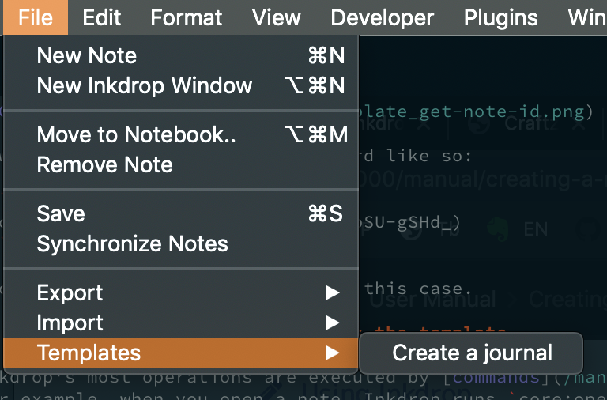

Once Inkdrop got become a part of your daily workflow, you may want to save time and effort with note templates.
Inkdrop provides powerful APIs to let you do that.
Here is a workthrough to make a note template for journaling.

## Create a note for template

Let's create a note something like this. Nothing special.



You will need a note ID of the note template.
Right-click the note and click *Copy Note Link* menu.



Now you've got a string in clipboard like so:

```
[journal template](inkdrop://note:bSU-gSHd_)
```

`note:bSU-gSHd_` is the note ID in this case.

## Create a command that duplicates the template

Inkdrop's most operations are executed by [commands](/manual/list-of-commands).
For example, when you open a note, Inkdrop runs `core:open-note` command internally.
You can define a [custom command](/reference/command-registry) via [the init file](/manual/the-init-file).
Let's make a command that creates new note based on your template.

In this example, you define a command named `custom:new-journal`.
Create `init.js` in [your data directory](/manual/basic-usage#user-data-directory) and write some scripts like so:


```js
inkdrop.commands.add(document.body, 'custom:new-journal', async () => {
  const db = inkdrop.main.dataStore.getLocalDB()
  const template = await db.notes.get('note:bSU-gSHd_')
  const note = {
    ...template,
    _id: db.notes.createId(),
    _rev: undefined,
    title: (new Date()).toLocaleDateString(),
    createdAt: +new Date(),
    updatedAt: +new Date()
  }
  try {
    await db.notes.put(note)
    inkdrop.commands.dispatch(document.body, 'core:open-note', { noteId: note._id })
  } catch (e) {
    console.error(e)
  }
})
```

Let's look at the lines we've added.

```js
  const db = inkdrop.main.dataStore.getLocalDB()
```

It gets an instance of [the local Inkdrop database](/reference/inkdrop-database).

```js
  const template = await db.notes.get('note:bSU-gSHd_')
```

Then, it loads the note with ID `note:bSU-gSHd_` by calling [DBNote's `get` method](/reference/db-note#getdocid-options).
It returns an object that represents [Note](/reference/data-models#a-nameresource-notenotea) data.

```js
  const note = {
    ...template,
    _id: db.notes.createId(),
    _rev: undefined,
    title: (new Date()).toLocaleDateString(),
    createdAt: +new Date(),
    updatedAt: +new Date()
  }
```

It manipulates new note from the template data.
The new note should have a unique ID, so it sets new one generated with [DBNote's `createId` method](/reference/db-note#createid) to `_id` field.
The `_rev` is a special field to handle revisions, which should be `undefined`.
It sets a new title based on date time by calling [Date::toLocaleDateString](https://developer.mozilla.org/en-US/docs/Web/JavaScript/Reference/Global_Objects/Date/toLocaleDateString).

```js
    await db.notes.put(note)
```

It saves the manipulated note to the local database by calling [DBNote's `put` method](/reference/db-note#putdoc).

```js
    inkdrop.commands.dispatch(document.body, 'core:open-note', { noteId: note._id })
```

It invokes `core:open-note` to open the new note.

## Add a menu to invoke the command

Next, we need a way to invoke the command we've made.
Inkdrop allows you to add custom [menus](/reference/menu-manager) and to run arbitrary commands.
The below code adds a menu to *File -> Templates -> Create a journal*, which runs `custom:new-journal` command.

```js
inkdrop.menu.add([
  {
    label: 'File',
    submenu: [{
      label: 'Templates',
      submenu: [{
        label: 'Create a journal',
        command: 'custom:new-journal'
      }]
    }]
  }
])
```

Now, let's check out what it looks like.
Inkdrop will evaluate `init.js` file every time you launch.
So, let's reload the app from menu: *Developer -> Reload*.
And you should see the menu is added like this:



Okay, let's run the command...


Boom! You've got a new note with the template content!

## Add a keymap for the command

It would be more useful to associate the command with [keybinding](/manual/customizing-keybindings).
Here is an example keybinding configuration:

```yaml
'body':
  'cmd-shift-j': 'custom:new-journal'
```

So you can quickly create notes with the template!
