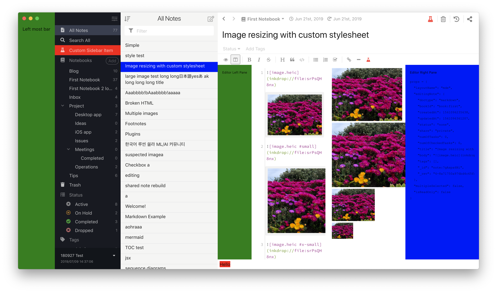

Inkdrop's UI is built on top of [React](https://reactjs.org/).
You can add your own React components to Inkdrop by invoking [Layout Manager](/reference/layout-manager) and [Component Manager](/reference/component-manager) APIs.

## Registering and unregistering a React component

To add your React components, you first have to register them to the [component registry](/reference/component-manager).
Then, the registered components can be added to layouts.
Below example registers `MyDialog` class to the component registry and adds it to `modal` layout so that you can show it as a modal view.

```js
module.exports = {
  activate() {
    inkdrop.components.registerClass(MyDialog)
    inkdrop.layouts.addComponentToLayout(
      'modal',
      'MyDialog'
    )
  },

  deactivate() {
    inkdrop.layouts.removeComponentFromLayout(
      'modal',
      'MyDialog'
    )
    inkdrop.components.deleteClass(MyDialog)
  }
}
```

This is described in detail in the [Word Count plugin](/manual/plugin-word-count#developing-our-plugin) walkthrough.

Available layouts can be found [here](/reference/state-layouts).

## Examples

Take a look at the [example plugin](https://github.com/inkdropapp/layout-example-plugin) which adds bars and buttons, replacing the default note list item view with custom one, etc.
Here is a screenshot:



We will explore along with this example to learn how to add components to each layout.

### Showing a custom dialog

* [Example: LayoutExampleMessageDialog](https://github.com/inkdropapp/layout-example-plugin/blob/master/lib/layout-example-message-dialog.js)

Inkdrop provides `MessageDialog` component so that you can easily create a custom dialog like so:

```js
render() {
  const MessageDialog = inkdrop.components.getComponentClass('MessageDialog')
  return (
    <MessageDialog ref={el => (this.dialogRef = el)} title="LayoutExample">
      LayoutExample was toggled!
    </MessageDialog>
  )
}
```

### Inserting a view into the main layout

* [Example: LayoutExampleLeftMostBar](https://github.com/inkdropapp/layout-example-plugin/blob/master/lib/layout-example-left-most-bar.js)

### Adding a sidebar menu item

* [Example: LayoutExampleSidebarMenuItem](https://github.com/inkdropapp/layout-example-plugin/blob/master/lib/layout-example-sidebar-menu-item.js)

### Adding a view into the editor layout

* [Example: LayoutExampleEditorLeftPane](https://github.com/inkdropapp/layout-example-plugin/blob/master/lib/layout-example-editor-left-pane.js)
* [Example: LayoutExampleEditorRightPane](https://github.com/inkdropapp/layout-example-plugin/blob/master/lib/layout-example-editor-right-pane.js)

### Adding an editor header button

* [Example: LayoutExampleEditorHeaderItem](https://github.com/inkdropapp/layout-example-plugin/blob/master/lib/layout-example-editor-header-item.js)

### Adding an editor toolbar button

* [Example: LayoutExampleEditorToolbarButton](https://github.com/inkdropapp/layout-example-plugin/blob/master/lib/layout-example-editor-toolbar-button.js)

### Adding an editor statusbar item

* [Example: LayoutExampleEditorStatusBarItem](https://github.com/inkdropapp/layout-example-plugin/blob/master/lib/layout-example-editor-status-bar-item.js)

### Replacing the note list item view

* [Example: LayoutExampleNoteListItemView](https://github.com/inkdropapp/layout-example-plugin/blob/master/lib/layout-example-note-list-item-view.js)

Inkdrop uses a custom component registered as `'CustomNoteListItemView'` in the component registry.
To register your component as custom note list item view:

```js
inkdrop.components.registerClass(
  LayoutExampleNoteListItemView,
  'CustomNoteListItemView'
)
```

Don't forget to unregister it when your plugin is deactivated:

```js
inkdrop.components.deleteClass(
  LayoutExampleNoteListItemView.default,
  'CustomNoteListItemView'
)
```
