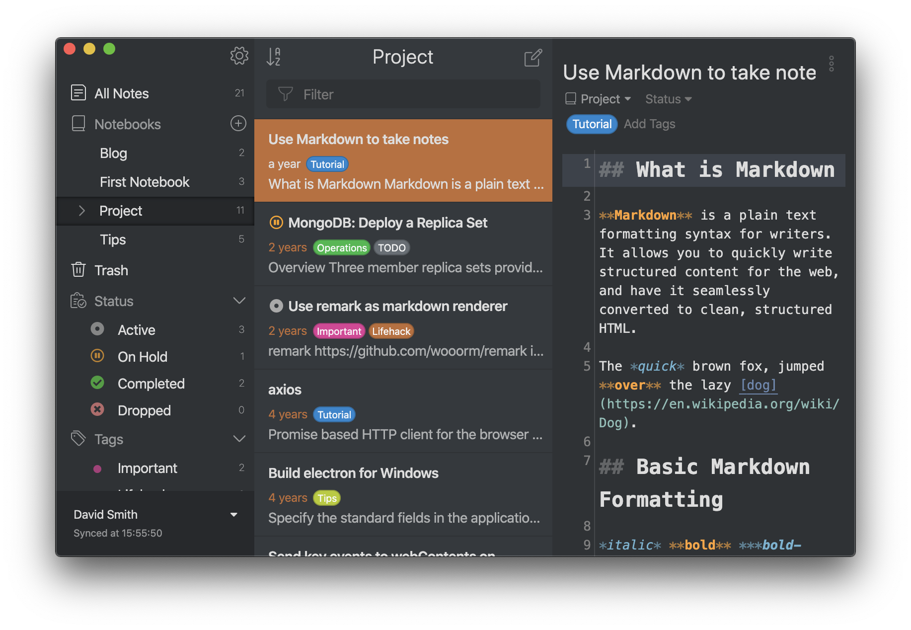
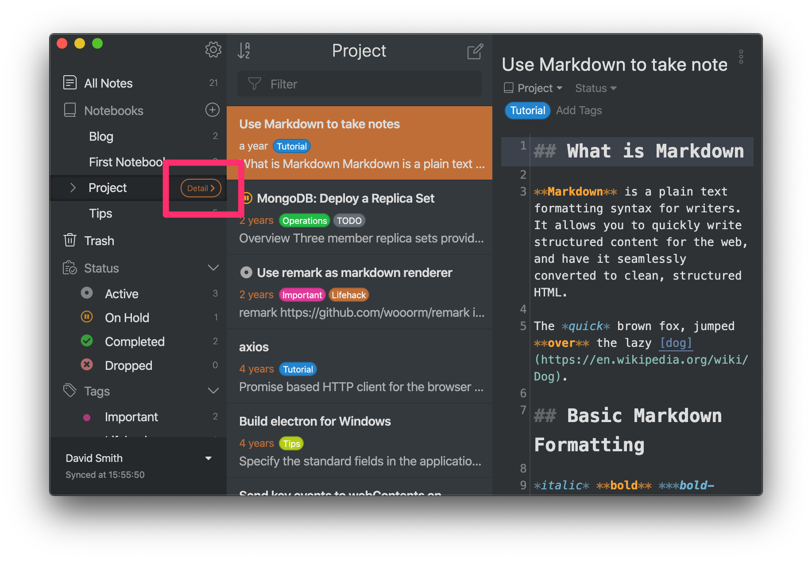
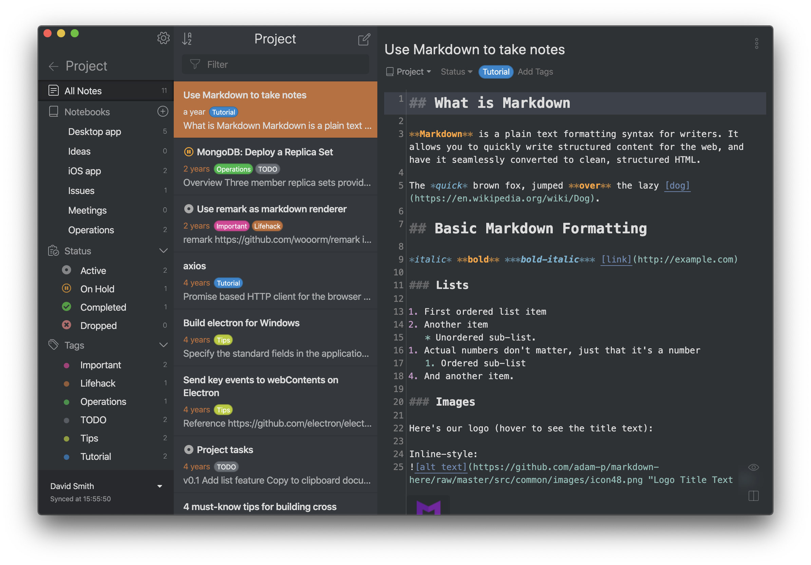
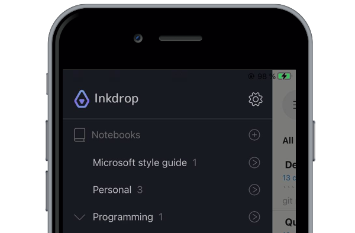
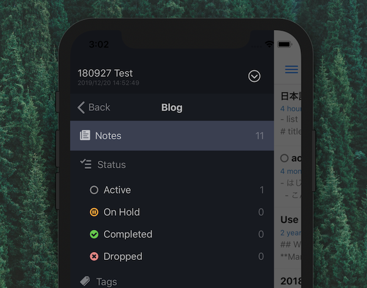

With your notes having organized with notebooks, tags and status, Inkdrop can help you navigate them elegantly.

## Go back/forward

<video controls playsInline muted>
  <source src="https://site-cdn.inkdrop.app/docs/manual/navigating-notes_history.mp4" type="video/mp4" />
</video>

Inkdrop allows you to navigate backward/forward into the opened notes just like web browsers.
You can move backward/forward in the following ways:

- Click back/forward button of your mouse
- Press <kbd>Cmd + ←</kbd>/<kbd>Cmd + →</kbd> on macOS or <kbd>Alt + ←</kbd>/<kbd>Alt + →</kbd> on Linux and Windows (Note: The shortcut keys don't work if the focus is at an input or editor)
- Choose menu _View → Back or Forward_

The commands for the navigation actions are [`core:navigate-back`](/manual/list-of-commands#corenavigate-back) and [`core:navigate-forward`](/manual/list-of-commands#corenavigate-forward).

## Collapsing/expanding notebook

You can have child notebooks recursively.
On the sidebar, child notebooks can be hidden by collapsing the parent notebook.

_<strong>Fig.1</strong> - Expanded notebook showing only notes directly under the notebook_

_<strong>Fig.2</strong> - Collapsed notebook showing all notes including the child notebooks_

Collapsed notebooks also show notes of their children.
In the above example, a notebook "Project" has one note and 6 child notebooks.
When it is expanded, it only shows the note directly associated with the notebook (_Fig.1_).
When it is collapsed, it includes all notes under the notebook, including its children (_Fig.2_).

## Workspace view

By default, the sidebar shows all notebooks, status and tags in your database.
It's all mixed together and hard to distinguish as you store notes about various projects.
You may think you want to see only information of a project you are currently working on.
Workspace feature allows you to switch the sidebar's view into a specific notebook.

### Desktop

You will see "Detail" button on the hovered/selected notebook item on the sidebar.
It's the button to switch the sidebar into a workspace view.
You can enter the view for the currently selected notebook by pressing <kbd>Enter</kbd> key.

In this view, you only see notebooks, statuses and tags that are under the notebook you have selected.
Other tags or notebooks are not shown, so you can focus on browsing notes of the particular project.

### Mobile

Tap "Detail" button on the right side of the notebook menu item on the side bar.

Then, the side bar lists statuses and tags that are associated with notes in the notebook.
So you can navigate notes in a particular notebook based on tags and status.
