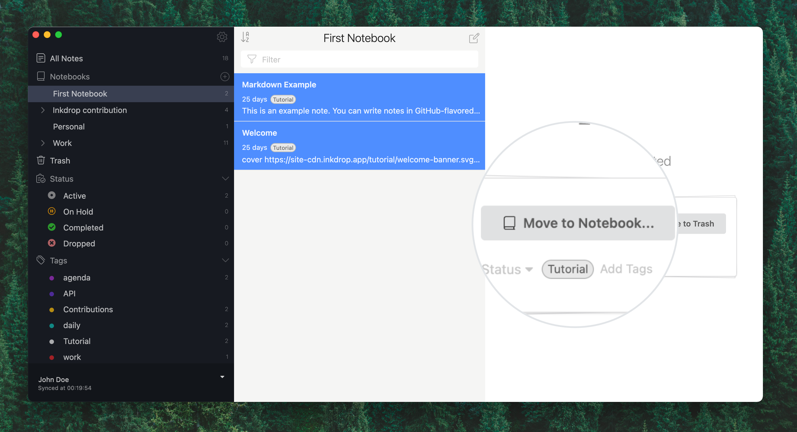
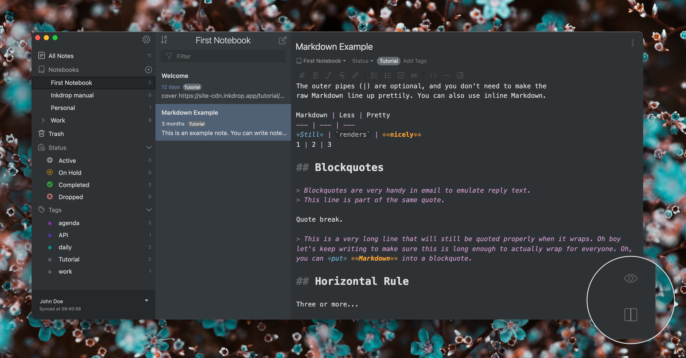

Notes are the hub of the Inkdrop universe. You can perform all CRUD (create, read, update, and delete) operations with them, duplicate, and export notes in various formats. 
Inkdrop supports both standard Markdown syntax and the
[GitHub Flavored Markdown (GFM)](/manual/markdown-cheatsheet) with inline formatting.

## Create notes

To create a note, click the  icon in the upper-right corner of the mote list. You can also use the <kbd>Command+N</kbd> / <kbd>Ctrl+N</kbd> shortcut.

Inkdrop will create an untitled empty note. Name the note, so it'll be easier to look for later. 

## Delete notes

To delete a note, right-click the note and select the **Move to trash** option. Alternatively, you can select a note with a left-click and use the <kbd>Command+Del</kbd> / <kbd>Ctrl+Del</kbd> shortcut.

Inkdrop also lets you delete multiple notes at once. To do this:

1. Holding the <kbd>Command</kbd> / <kbd>Ctrl</kbd> key, select the notes you want to delete.  
   Inkdrop will show the number of selected notes in the rightmost area.
2. On the right screen, click ** Move to Trash**.

### Restore deleted notes

Inkdrop lets you restore the deleted notes. To do this, take the following steps:

1. In the sidebar, go to  **Trash**.
2. Select the note(s) you want to restore and click  **Move to Notebook** in the rightmost area.  
   
3. In the **Move to Notebook** dialog, select a notebook where you want to restore the notes.
   The notes will be restored to the selected notebook.

### Delete notes permanently

If you delete your notes permanently, there's no way to restore them.

To delete notes permanently, take the following steps:

1. In the sidebar, go to  **Trash**.
2. Select the note(s) you want to delete permanently and click ** Delete Permanently** in the rightmost area.

The selected notes will be deleted forever.

## Make copy of notes

Inkdrop lets you make a complete copy of notes. It means that the copy has the same title, content, and tags. 

To duplicate notes, right-click the notes and select **Duplicate**. Alternatively, you can select the notes and use the <kbd>Command+D</kbd> shortcut.

A note copy will be created in the current notebook.

## Live preview

Inkdrop lets you preview notes to see what they will eventually look like. Use <kbd>Command+P</kbd> / <kbd>Ctrl+P</kbd> to display note and its preview side-by-side.

You can also toggle the preview mode by clicking the  icon in the lower right corner of the editor. 
Or click  to toggle note and its preview side-by-side.

Note that the icons are hidden unless you hover the mouse cursor over the editor.

## Distraction Free Mode

'Distraction Free Mode' lets you focus on the writing process by hiding the sidebar and note list. To toggle the 'Distraction Free Mode', use <kbd>Command+Shift+D</kbd> / <kbd>Ctrl+Shift+D</kbd>. 

You can even hide the toolbar with controls for quick formatting. For this, take the following steps:

1. Open **Preferences** by clicking the  icon in the upper right corner of the sidebar.  
   You can also use <kbd>Command+,</kbd> / <kbd>Ctrl+,</kbd>.
2. Go to **Editing** and clear the **Toolbar** checkbox.  
   It will hide the toolbar.  