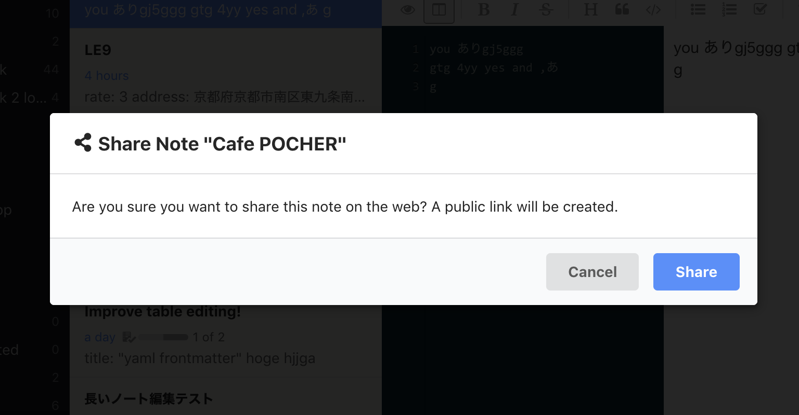

A built-in React [component](/reference/component-manager) of Inkdrop that allows you to display a simple modal dialog with buttons.
To get the class of `MessageDialog` component:

```js
const MessageDialog = inkdrop.components.getComponentClass("MessageDialog")
```

## Props

```flow
type Props = {|
  title: string | (() => React.Node),
  message: string,
  buttons: MessageDialogButton[],
  autofocus: boolean,
  className?: string,
  onDismiss?: (dialog: MessageDialog, buttonIndex: number) => boolean,
  onHidden?: (dialog: MessageDialog, buttonIndex: number) => any,
  children: React.Node,
|}

type MessageDialogButton = {
  label: string,
  primary?: boolean,
  destructive?: boolean,
}
```

## Example

```js
<MessageDialog
  title={() => (
    <span>
      <i className="share alternate icon" />
      Share Note &quot;{note && note.title}&quot;
    </span>
  )}
  buttons={[
    { label: "Cancel", cancel: true },
    { label: "Share", primary: true },
  ]}
  onDismiss={(caller, buttonIndex) => {
    if (buttonIndex === 1 /* Share */) {
      // prevent the dialog from closing
      return false
    } else {
      return true
    }
  }}
>
  <p>
    Are you sure you want to share this note on the web? A public link will be
    created.
  </p>
</MessageDialog>
```

It produces:


